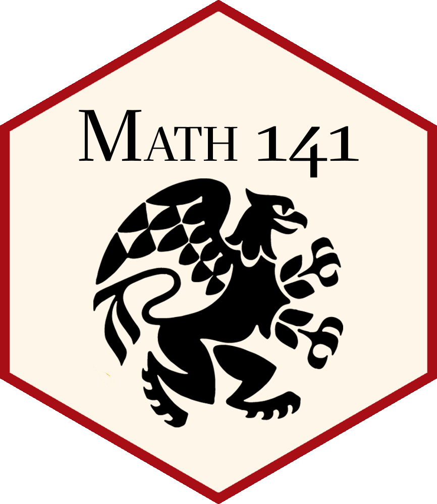

:::::::: content-block
::::::: grid
::::: {#banner .g-col-12 .g-col-md-6 style="margin: 3em 1em 0em 1em"}
:::: {.content-visible unless-profile="staff-site"}
::: banner-text
Data Science
:::

[Math 241 Reed College, Spring 2026]{.smallcaps}

::::
:::::

::: {#hex .g-col-12 .g-col-md-6 .text-center style="margin: 0em 1em 0em 1em"}
\

{.img-fluid fig-alt="Hex logo of Math 241 logo." width="250"}
:::
:::::::
::::::::

:::: content-block
::: {#schedule-listing}
:::
::::
