```{r}
#| include: false
#| warning: false
#| message: false

knitr::opts_chunk$set(echo = TRUE, warning = FALSE, message = FALSE, 
                      fig.retina = 3, fig.align = 'center')
library(knitr)
library(tidyverse)
```

::::: columns
::: {.column .center width="60%"}
{width="90%"}
:::

::: {.column .center width="40%"}
<br>

[Data Science]{.custom-title}

<br> <br> <br> <br>

[Grayson White]{.custom-subtitle}

[Math 241 <br> Week 1 \| Fall 2025]{.custom-subtitle}
:::
:::::

------------------------------------------------------------------------

::: {style="margin-top: 80px; font-size: 3em; color: #3F6574; text-align: center;"}

Before we get started...

if you are on the waitlist, please sign in to class here: [tinyurl.com/math141-wait](https://tinyurl.com/math141-wait)
:::


------------------------------------------------------------------------

## Goals for Today

::: {.nonincremental}

-   Getting started in Math 141
    - Course structure and technologies
    - Where to find resources 
    - Course expectations
-   Statistical thinking 
-   Data Frames

:::


# But first, let me quickly introduce myself...

------------------------------------------------------------------------

### Let's start with my path (back) to Reed...

```{r, echo = FALSE, dev.args = list(bg = 'transparent'), fig.asp = .6, out.width = '80%'}
library(tidyverse)
library(shadowtext)

MainStates <- map_data("state")

ggplot() +
  geom_polygon(
    data = MainStates,
    aes(x = long, y = lat, group = group),
    
    color = "white",
    fill = "#7E8A65",
    size = 1.25
  ) +
  theme_void() +
  geom_shadowtext(
    aes(
      x = -111.8881,
      y = 40.7606,
      label = "Forest Service"
    ),
    color = "white",
    size = 5,
    bg.color = "#7E8A65"
  ) +
  geom_shadowtext(
    aes(
      y = 45.523064 - 0.5,
      x = -122.676483 + 1,
      label = "Reed College"
    ),
    color = "white",
    size = 5,
    bg.color = "#7E8A65"
  ) +
  geom_shadowtext(
    aes(
      y = 42.7336,
      x = -84.5539,
      label = "Michigan State\nUniversity"
    ),
    color = "white",
    size = 5,
    bg.color = "#7E8A65"
  ) + 
  geom_segment(aes(x = -122.676483 + 1, y = 45.523064 - 0.5,
                   xend = -111.8881, yend = 41.5),
               color = "red", arrow.fill = "red",
    arrow = arrow(type = "closed")) +
    geom_segment(aes(xend = -116.5, yend = 45.523064 - 0.5,
                   x = -90, y = 42.7),
               color = "red", arrow.fill = "red",
    arrow = arrow(type = "closed")) +
    geom_segment(aes(xend = -90, yend = 42.7,
                   x = -106, y = 40.7606),
               color = "red", arrow.fill = "red",
    arrow = arrow(type = "closed")) +
  theme(legend.position = "none")
```

------------------------------------------------------------------------

## Research Interests {.center}

::: {.fragment .fade-up .midi}

#### Statistical modeling with environmental applications 

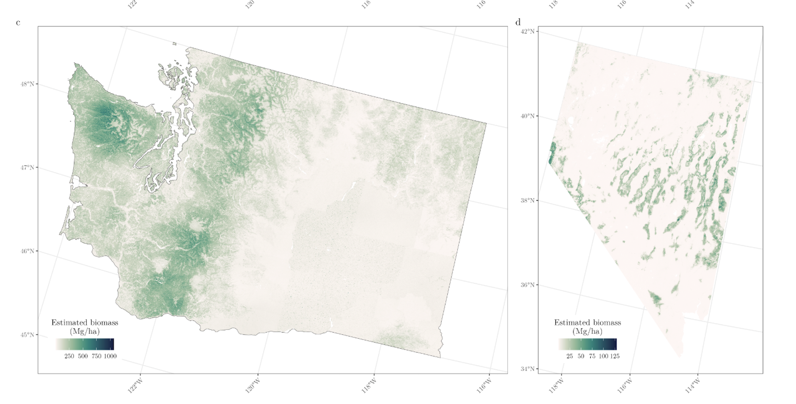

:::

------------------------------------------------------------------------

## Research Interests {.center}

#### Advising Undergraduate Forestry Data Science Research

::: {.fragment .fade-up .midi}

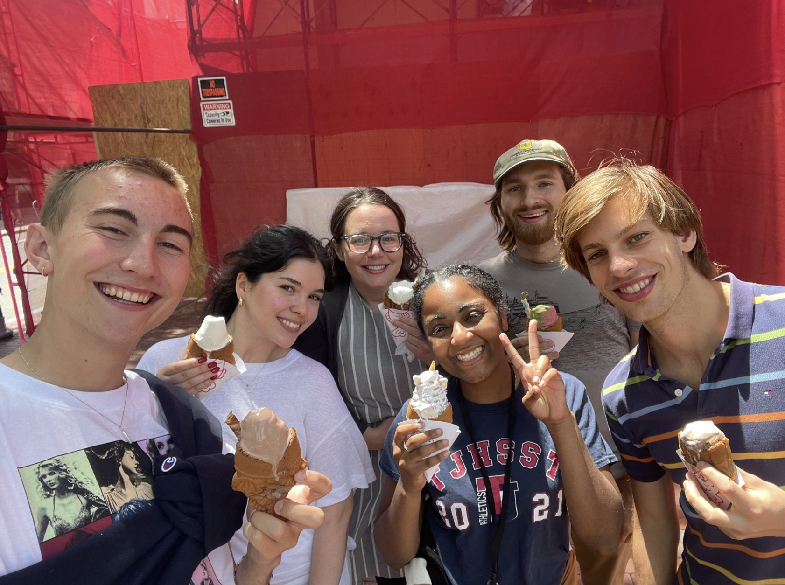{width=60%}

:::


## Getting Started in Math 141

#### Course website

:::: {.columns}

::: {.column width="70%"}

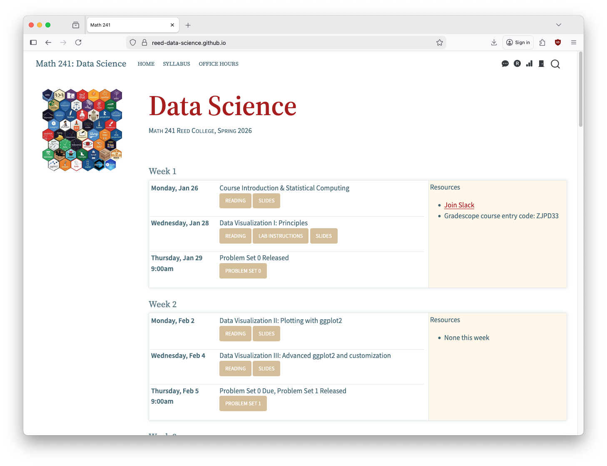

:::


::: {.column width="30%"}

-   The course website, [math-141.github.io](https://math-141.github.io/), will be the central location for all our course materials. 

-   We'll use a few other resources to navigate Math 141, but all other tools can be accessed by the quick links in the course website! 

:::

::::


------------------------------------------------------------------------

## Getting Started in Math 141

#### Other Resources 

<br>

::: {.fragment .fade-up .midi}

Reed's **RStudio Server**, for coursework,

:::

<br>

::: {.fragment .fade-up .midi}

A course-wide **Slack** workspace, for course communication,

:::

<br>

::: {.fragment .fade-up .midi}

**Gradescope**, for turning in assignments and exams, and

:::

<br>

::: {.fragment .fade-up .midi}

**Moodle**, sparingly, for private course materials

:::

------------------------------------------------------------------------


## Getting Started in Math 141: Finding Resources

:::: {.columns}

::: {.column width="20%"}

:::

::: {.column width="60%"}

{fig-align='center'}

:::


::: {.column width="20%"}

:::

::::
------------------------------------------------------------------------


## Getting Started in Math 141: Finding Resources

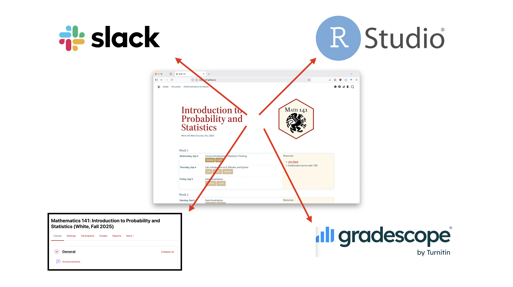{fig-align='center'}

------------------------------------------------------------------------

## Getting Started in Math 141: Finding Resources

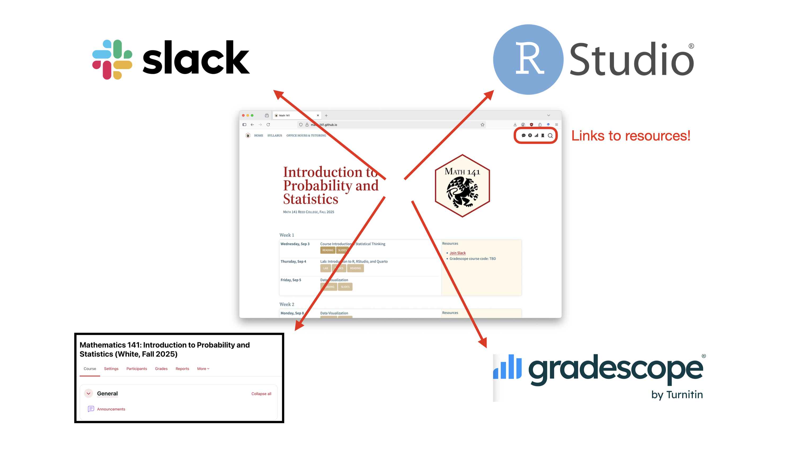{fig-align='center'}


# Let's take a look at the course website...

**[math-141.github.io](https://math-141.github.io/)**


## Math 141: The whole game {.center}

:::: {.columns}

::: {.column width="50%"}

::: {.fragment .fade-up .midi}


:::

:::

::::


## Course expectations and structure 

::: {.fragment .fade-up .midi}

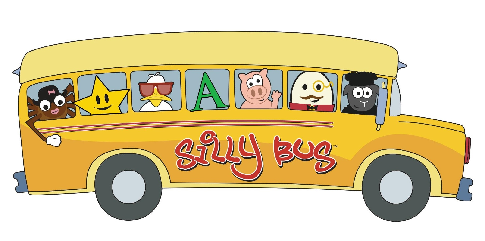

:::

------------------------------------------------------------------------


## My info {.center}

<br>

::: {.fragment .fade-up .midi}


**Name**: Grayson White (he/him), you can call me 'Grayson'

**Email**: [gwhite@reed.edu](mailto:gwhite@reed.edu)

**Office**: Library 390

**Office hours**: Monday 2:30-4, Wednesday 1-2:30, or by appointment

:::


------------------------------------------------------------------------

## A typical day in Math 141 {.center}


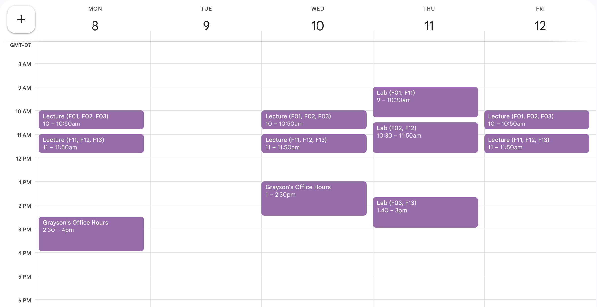


# Also, the Math 141 Teaching Team are so excited to support your learning!

Course assistant office hours coming soon! 

------------------------------------------------------------------------

## Learning Outcomes {.center}

:::: {.columns}

::: {.column width="50%"}


:::


::: {.column width="50%"}

-   In this course, you will learn how to think critically with data by engaging in the entire data analysis process.

-   Most of our time will be spent in the **Exploration and Visualization**, **Data Wrangling**,  and **Modeling and Inference** steps, but we will spend some time in each cog!
    - First ~3 weeks in **Exploration and Visualization** and **Data Wrangling**
    - Next ~3 weeks in **Modeling**
    - Final ~half of the course in **Inference**

:::

::::


<!-- ## Learning Materials {.center} -->

<!-- <br> -->

<!-- ::: {.fragment .fade-up} -->

<!-- **Textbooks** -->

<!-- -   [Statistical Inference via Data Science: A ModernDive into R and the tidyverse, Second Edition](https://moderndive.com/v2) (**MD**) -->
<!-- -   [Introduction to Modern Statistics, Second Edition](https://www.openintro.org/book/ims/) (**IMS**) -->
<!-- -   [OpenIntro Statistics, Fourth Edition](https://www.openintro.org/book/os/) (**OI**) -->


<!-- ::: -->

<!-- <br> -->

<!-- ::: {.fragment .fade-up} -->


<!-- **Technologies** -->

<!-- -   **R**, **RStudio**, and **Quarto**. More on these in lab tomorrow! -->

<!-- ::: -->

<!-- ------------------------------------------------------------------------ -->

## Assignments and Exams


::: {.nonincremental}

:::: {.columns}

::: {.column width="45%"}

::: {.fragment .fade-up}

-   **Lab assignments (*weekly-ish*)**
    - Assigned Thursday in lab
    - Due the following Thursday at 9am
    - Assigned each week besides exam weeks
    
:::

::: {.fragment .fade-up}

-   **Homework assignments (*daily-ish*)**
    - Assigned most days in lecture
    - Due in person at the following lecture
    - Much shorter than the labs, often related to the daily reading
    
:::

:::

::: {.column width="10%"}

:::

::: {.column width="45%"}

::: {.fragment .fade-up}

-   **In-class activities (*semi-regular*)**
    - Individual activities
    - Group activities
    - Low-stakes quizzes
    
:::

::: {.fragment .fade-up}


-   **Exams (*1 midterm, 1 final*)**
    - Both have a written component and an oral component.
    - Midterm written: 10/12 - 10/14
    - Midterm orals: 10/15-10/16
    - Final written: reading week
    - Final orals: finals week
    
:::

:::


::::

:::


## Course Climate 

::: blockquote

We expect everyone in this class to strive to foster a learning environment that is equitable, inclusive, and welcoming. If you experience any barriers to learning, please come to Professor Grayson White or a college administrator with your concerns.

<br>

**Code of Conduct**:


We expect all members of Math 141 to make participation a harassment-free experience for everyone, regardless of age, body size, visible or invisible disability, ethnicity, sex characteristics, gender identity and expression, level of experience, education, socio-economic status, nationality, personal appearance, race, religion, or sexual identity and orientation.

We expect everyone to act and interact in ways that contribute to an open, welcoming, inclusive, and healthy community of learners. You can contribute to a positive learning environment by demonstrating empathy and kindness, being respectful of differing viewpoints and experiences, and giving and gracefully accepting constructive feedback.[^1]

[^1]: This Code of Conduct is adapted from the [Contributor Covenant](https://www.contributor-covenant.org/version/2/0/code_of_conduct.html), version 2.0.

:::

```{r}
#| echo: false
countdown::countdown(1)
```


## Late Work

::: {.nonincremental}

:::{.fragment .fade-up}

-   **Labs**: up to 4 extensions days can be used throughout the semester.
    - e.g., 1 additional day for 4 labs, 4 additional days for 1 lab, ...
    - rounding days up
    
:::

:::{.fragment .fade-up}

-   **Homeworks**: no late homework assignments are accepted, but the lowest three scores will be dropped.

:::

:::{.fragment .fade-up}

-   **In-class assignments**: cannot be made up.

:::

:::{.fragment .fade-up}

-   **Exams**: no late exams are accepted.

:::

:::


## Artificial Intelligence (AI) Policy


::: blockquote

Artificial intelligence (AI) tools, such as ChatGPT, Claude, Gemini, and others are being used to generate code, analyze data, and much more. However, learning to think critically about a problem at hand, and engaging with your peers, tutors, and instructors when not understanding a concept or question are integral components of a liberal arts education. Further, a key goal of this course is for you to learn how to thoughtfully, ethically, and independently extract knowledge from data and engage in statistical reasoning. Therefore, the use of generative AI tools, such as ChatGPT and others, are strictly prohibited in any stage of the work process for this course. If you have questions about whether a tool is allowed for this course, ask the Instructor before using it.

:::

```{r}
#| echo: false
countdown::countdown(1)
```


- Why this policy?


## Engagement

::::: columns
::: {.column width="50%"}
<br> <br>

{width="90%" fig-align="center"}

-   Being **actively present** is key.
:::

::: {.column width="50%"}
-   During lecture and lab, remove distractions.
    -   When we are on our computers, close email, social media, news, etc.
    -   Hide your phone.
-   I have high expectations but know that all of you (regardless of your stats, math, or computing background) have the ability to meet them.
:::
:::::


# Course or syllabus questions? 

## Math 141 is about developing our **statistical thinking** skills. {.center}

<br>

::: {.fragment .fade-up .midi}
What is **statistical thinking**?
:::

<br>

::: {.fragment .fade-up .midi}
It is not the same as mathematical thinking.
:::

<br>

::: {.fragment .fade-up .midi}
Let's discover what **statistical thinking** is through some examples.
:::

------------------------------------------------------------------------

## Data in Math 141

Will use a wide-range of **real** and **relevant** data examples

::::: columns
::: {.column .center width="50%"}
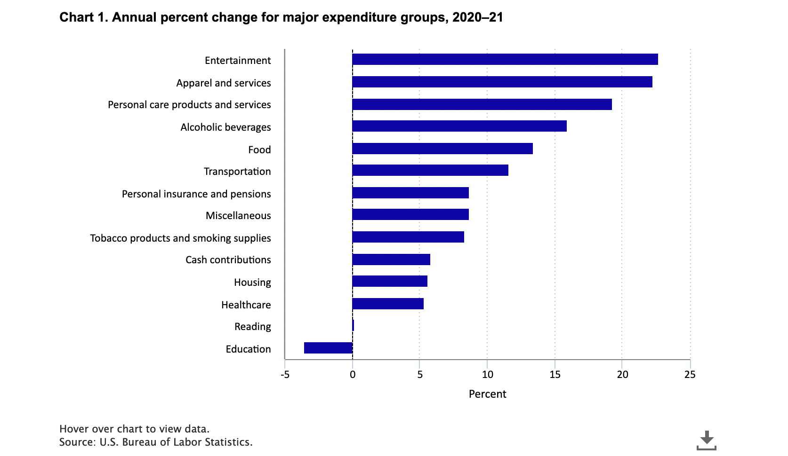{width="100%"}
:::

::: {.column .center width="50%"}
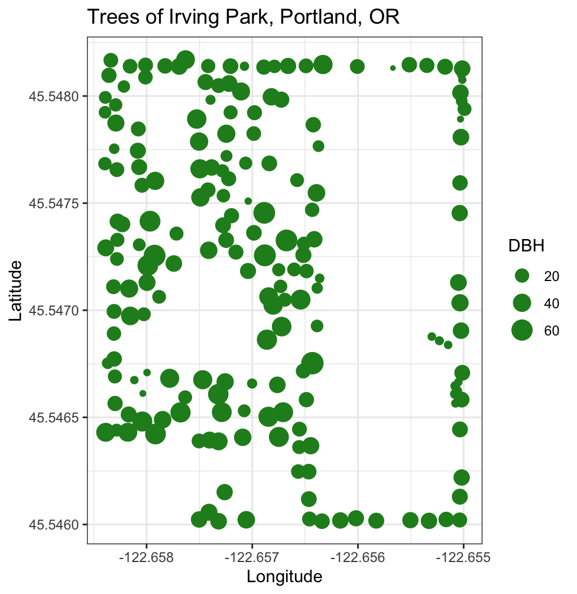{width="80%"}
:::
:::::

------------------------------------------------------------------------

## Data in Math 141

::::: columns
::: {.column .center width="50%"}
{width="100%"}
:::

::: {.column .center width="50%"}
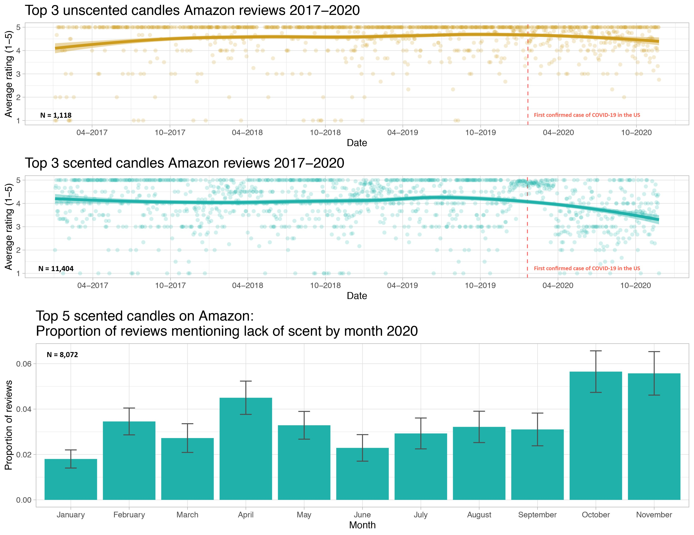{width="80%"}
:::
:::::

-   I understand that some of these topics have likely had profound impacts on your lives.

-   We will focus class time on the key course objectives but will use these current topics to empower ourselves and to see how we can productively participate with data.

# Example: Visualizing COVID Prevalence

------------------------------------------------------------------------

## Example: Visualizing COVID Prevalence

-   In May of 2020, the Georgia Department of Public Health posted the following graph:

::: {.fragment .midi}
{width="50%" fig-align="center"}
:::

-   At a quick first glance, what story does the graph appear to be telling?

-   What is misleading about the graph? How could we fix this issue?

------------------------------------------------------------------------

## Example: Visualizing COVID Prevalence

-   After public outcry, the Georgia Department of Public Health said they made a mistake and posted the following updated graph:

::: {.fragment .midi}
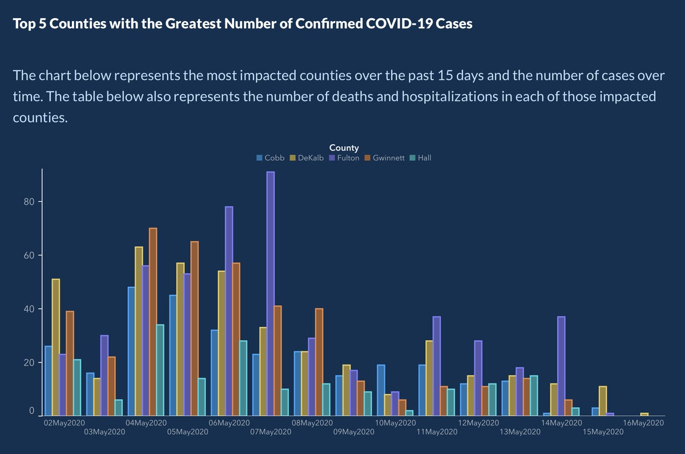{fig-align="center" width="40%"}
:::

-   How do your conclusions about COVID-19 cases in Georgia change when now interpreting this new graph?

------------------------------------------------------------------------

## Example: Visualizing COVID Prevalence 

Alberto Cairo, a journalist and designer, created the second graph of the Georgia COVID-19 data:

::: {.fragment .midi}
{width="40%"} {width="40%"}
:::

-   A key principle of data visualization is to **"help the viewer make meaningful comparisons"**.

-   What comparisons are made easy by the lefthand graph? What about by the righthand graph?

-   From these graphs, can we get an accurate estimate of the COVID prevalence in these Georgian counties over this two week period?


## Statistical Thinking

-   About developing **reasoning** (not just learning definitions and formulae).

-   Statistical thinking requires **judgment** that takes time to develop.

    -   Will see **examples** and **practice** applying statistical thinking throughout the course.

-   Developing our statistical thinking skills will allow us to soundly **extract knowledge from data**!

------------------------------------------------------------------------

## [What are/is Data?]{.center}

<br>

<br>

::: blockquote
*"'Raw data' is an oxymoron."* -- Lisa Gitelman
:::

<br>

::: blockquote
*"Data ... is information made tractable."* -- Catherine D'Ignazio and Lauren Klein
:::

------------------------------------------------------------------------

## Data Frames

Data in **spreadsheet**-like format where:

-   Rows = Observations/cases

-   Columns = Variables

```{r}
#| echo: false
# pak::pak("simonpcouch/detectors")
library(tidyverse)
library(knitr)
library(kableExtra)
library(detectors)

detectors %>%
  mutate(ID = row_number()) %>%
  relocate(ID) %>%
  select(-document_id, -prompt) %>%
  head() %>%

  kable() %>%   
  kable_styling(bootstrap_options = c("responsive", "bordered", "striped", "compact"),
                font_size = 32)

```

-   Data from **GPT Detectors Are Biased Against Non-Native English Writers.** *Weixin Liang*, *Mert Yuksekgonul*, *Yining Mao*, *Eric Wu*, *James Zou.* [CellPress Patterns](https://doi.org/10.1016/j.patter.2023.100779) and available in the `R` package `detectors`.

------------------------------------------------------------------------

## Data Frames

```{r}
#| echo: false

detectors %>%
  mutate(ID = row_number()) %>%
  relocate(ID) %>%
  select(-document_id, -prompt) %>%
  head() %>%

  kable() %>%   
  kable_styling(bootstrap_options = c("responsive", "bordered", "striped", "compact"),
                font_size = 32)

```

Rows = Observations/cases

**What are the cases? What does each row represent?**

------------------------------------------------------------------------

## Data Frames

```{r}
#| echo: false

detectors %>%
  mutate(ID = row_number()) %>%
  relocate(ID) %>%
  select(-document_id, -prompt) %>%
  head() %>%

  kable() %>%   
  kable_styling(bootstrap_options = c("responsive", "bordered", "striped", "compact"),
                font_size = 32)

```

Columns = Variables

**Variables**: Describe characteristics of the observations

-   **Quantitative**: Numerical in nature

-   **Categorical**: Values are categories

-   **Identification**: Uniquely identify each case

------------------------------------------------------------------------

```{r}
#| echo: false

detectors %>%
  mutate(ID = row_number()) %>%
  relocate(ID) %>%
  select(-document_id, -prompt) %>%
  head() %>%

  kable() %>%   
  kable_styling(bootstrap_options = c("responsive", "bordered", "striped", "compact"),
                font_size = 32)

```

Every time you get a new dataset, spend time exploring the variables.

Example questions:

-   Is each variable capturing the desired information?

-   For categorical variables, what are the categories? Do those categories adequately represent that variable?

-   For quantitative variables, what values are possible? Were the data rounded or binned? Are those values actually encoding categories? What are the units of measurement?

## Next time

## Next time 

### Problem 1 of Lab 1: Create your own Dear Data postcard!

::::: columns
::: {.column .center width="40%"}
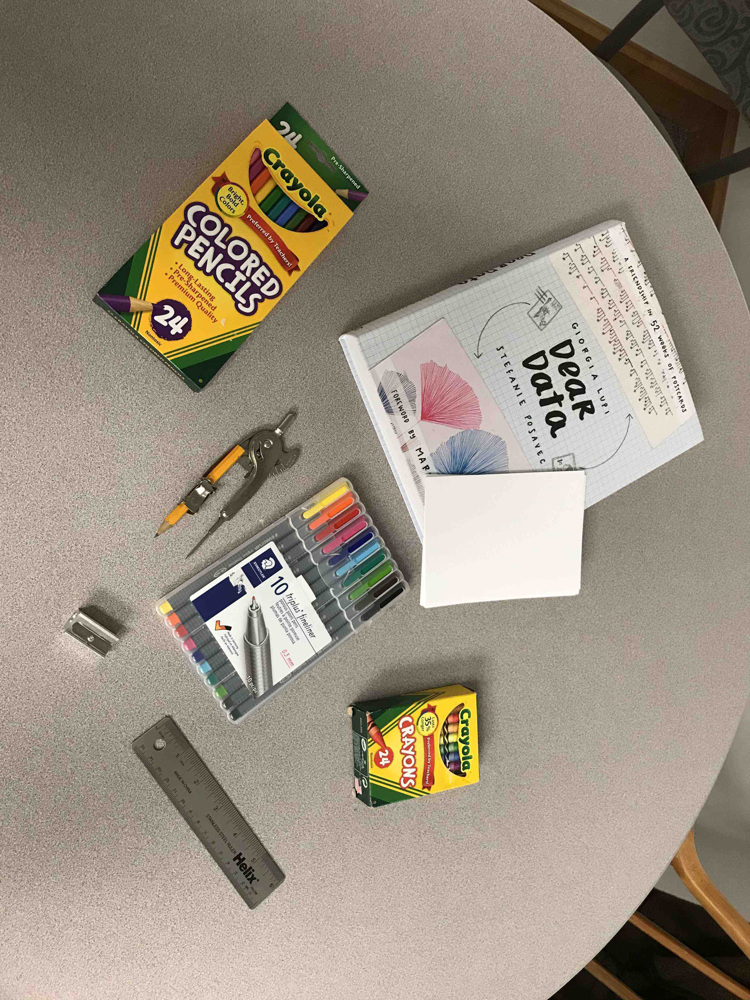{width="70%" fig-align="center"}
:::

::: {.column width="\"60%"}
-   **Step 1**: Collect data on some aspect of your life.

-   **Step 2**: Find a story in your data and determine your postcard recipient.

-   **Step 3**: Figure out how you want to visualize the story.

-   **Step 4+**: Visualize your data on a blank postcard.

:::
:::::


-   Bring a laptop to lab tomorrow! 


